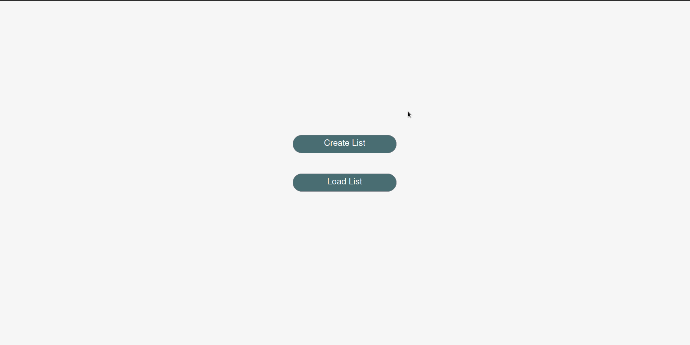

# TODOList

TODOList helps to define the steps for work performing.
Can be a list of notes or reminders.

It is a single-page web application, that creates a list of tasks for performing.
The tasks can be added, deleted, modified, mark as completed, changed the places.
The list can be saved into the database, retrieved and deleted.

Client application implemented with bootstrapVue, Vuex, Axios.
Server application implemented with Django, Django REST framework.
Database PostgreSQL v12.

## Goals:

- Using the Django framework with the PostgreSQL user-defined views, procedures, and functions.

- Creating the API with Django REST framework, for interaction with the Django server application.

- A brief look at bootstrapVue.

